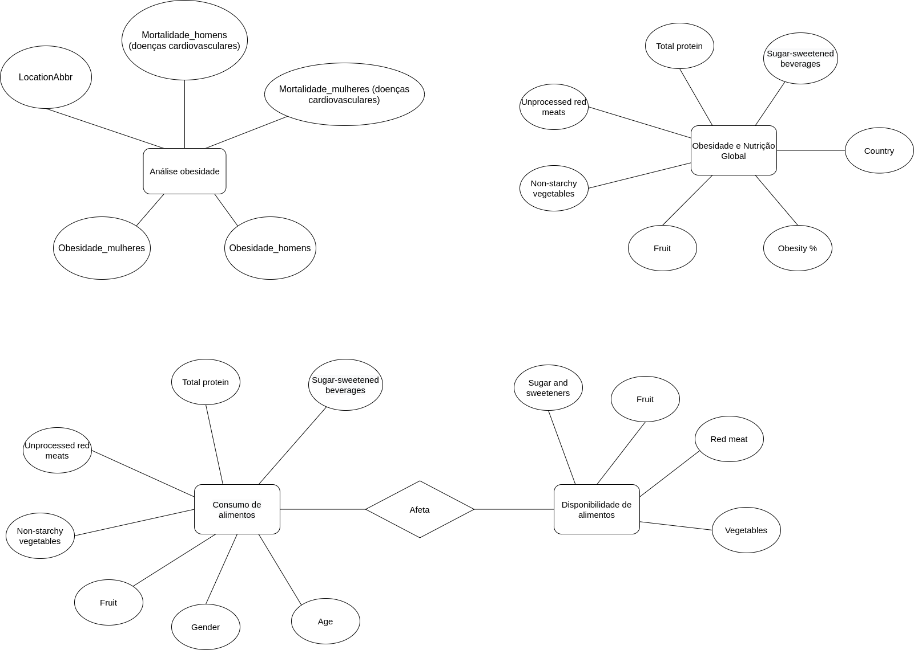

Estrutura de pastas:

~~~
├── README.md  <- arquivo apresentando a proposta
│
├── data
│   ├── external       <- dados de terceiros em formato usado para entrada na transformação
│   ├── interim        <- dados intermediários, e.g., resultado de transformação
│   ├── processed      <- dados finais usados para a modelagem
│   └── raw            <- dados originais sem modificações
│
├── notebooks          <- Jupyter notebooks ou equivalentes
│
├── slides             <- arquivo de slides em formato PDF
│
├── src                <- fonte em linguagem de programação ou sistema (e.g., Cytoscape)
│   └── README.md      <- instruções básicas de instalação/execução
│
└── assets             <- mídias usadas no projeto
~~~

# Etapa 04 - Análises com o Segundo Modelo Lógico

* Jupyter:  

## Slides da Apresentação da Etapa

> Coloque um link para o arquivo dos slides da apresentação que estão na pasta `slides`.

## Modelo Conceitual Atualizado

## Modelos Lógicos Atualizados

> Coloque aqui os dois modelos lógicos dos bancos de dados relacionados aos modelos conceituais. O modelo lógico da etapa anterior pode ser copiado ou apresentado revisado. Para o modelo relacional, sugere-se o formato a seguir. Para outros modelos lógicos o formato é livre, pode ser adotado aqueles apresentados em sala.

> Exemplo de modelo lógico relacional
~~~
Análise obesidade(LocationAbbr,  Mortalidade_homens, Mortalidade_mulheres, Obesidade_homens, Obesidade_mulheres)

Consumo de alimentos(Gênero, Idade, Carne vermelha, Frutas, Vegetais, Proteína, Bebidas açucaradas)

Disponibilidade(Açúcares, Frutas, Carne Vermelha, Vegetais)

Obesidade e Nutrição Global(Country, Obesity, Fruit, Non-starchy vegetables, Unprocessed red meats, Total protein, Sugar-sweetened beverages)
~~~

## Programa de extração e conversão de dados atualizado

> Coloque um link para o arquivo do notebook que executa a extração e conversão de dados. Ele estará dentro da pasta `notebook`. Se por alguma razão o código não for executável no Jupyter, coloque na pasta `src`. Se a extração e conversão envolverem queries executadas atraves de uma interface de um SGBD não executável no Jupyter, como o Cypher, apresente na forma de markdown.  
[Extracao Consumo Alimentos](./notebooks/extracaoConsumoAlimentosipynb)  
[Extracao Global Obesity](./notebooks/extracaoGlobalObesity.ipynb)

## Conjunto de queries de dois modelos

> Acrescente um link para o arquivo do notebook que executa o segundo conjunto de queries. Ele estará dentro da pasta `notebook`. Se por alguma razão o código não for executável no Jupyter, coloque na pasta `src`. Se as queries forem executadas atraves de uma interface de um SGBD não executável no Jupyter, como o Cypher, apresente na forma de markdown.
> O link para queries da etapa 3 também deve aparecer aqui e as queries poderão ser revisadas.

## Bases de Dados
> Elencar as bases de dados utilizadas no projeto. Trata-se de uma atualização daquelas apresentadas na Etapa 3.

título da base | link | breve descrição
----- | ----- | -----
Obesity | http://dbpedia.org/page/Obesity | Página da DBpedia com informações úteis e definições sobre Obesidade.
Obesity Stats | https://www.kaggle.com/adu47249/obesity-stats | Estatística sobre peso nos Estados Unidos do ano 2011 até 2016.
Heart Disease Mortality | https://catalog.data.gov/dataset/heart-disease-mortality-data-among-us-adults-35-by-state-territory-and-county-d31fc/resource/5974720b-7972-4272-8eb1-277dfdc538c2 | Mortalidade por doenças do coração em adultos (+35 anos) nos EUA.
Prevalence of obesity among adults | https://apps.who.int/gho/data/node.main.BMI30C?lang=en | Prevalência de obesidade entre adultos, BMI ≥ 30, estimativas brutas por país.
Food Availability | https://www.ers.usda.gov/data-products/food-availability-per-capita-data-system/ | Disponibilidade de comida per capita nos EUA.
Global Dietary Database | https://www.globaldietarydatabase.org/ | Consumo de grupos de alimentos em diversos países, separado por faixa etária, nível de educação, entre outros.

## Arquivos de Dados
> Elencar os arquivos usados no projeto que estão disponíveis no Github do projeto (manter os da Etapa 3 e acrescentar os da Etapa 4).

nome do arquivo | link | breve descrição
----- | ----- | -----
`<nome do arquivo>` | `<link para o arquivo>` | `<breve descrição do arquivo>`
Food Availability | https://www.ers.usda.gov/data-products/food-availability-per-capita-data-system/ | Disponibilidade de comida per capita nos EUA.
Global Dietary Database | https://www.globaldietarydatabase.org/ | Consumo de grupos de alimentos em diversos países, separado por faixa etária, nível de educação, entre outros.
