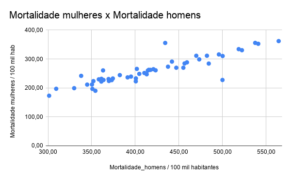
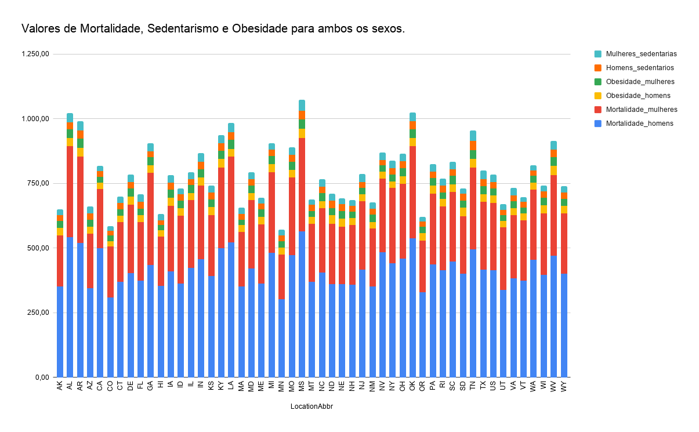

Estrutura de pastas:

~~~
├── README.md  <- arquivo apresentando a proposta
│
├── data
│   ├── external       <- dados de terceiros em formato usado para entrada na transformação
│   ├── interim        <- dados intermediários, e.g., resultado de transformação
│   ├── processed      <- dados finais usados para a modelagem
│   └── raw            <- dados originais sem modificações
│
├── notebooks          <- Jupyter notebooks ou equivalentes
│
├── slides             <- arquivo de slides em formato PDF
│
├── src                <- fonte em linguagem de programação ou sistema (e.g., Cytoscape)
│   └── README.md      <- instruções básicas de instalação/execução
│
└── assets             <- mídias usadas no projeto
~~~

# Etapa Final

# Projeto de Banco de Dados da disciplina de MC536 2s2020

## Equipe Kinda SUS
* Felipe Hideki
* Julio Kiyoshi
* Matheus Fernandes

* Jupyter:  

## Slides da Apresentação da Etapa Final

[Etapa 5 - Análise Final](https://github.com/MatheusCod/Kinda_SUS-MC536_2s2020/blob/main/stage05/slides/Etapa%205%20-%20An%C3%A1lise%20Final.pdf)

## Resumo do Projeto
Este projeto tem o propósito de realizar uma análise de dados relacionados à obesidade com o objetivo de usá-los em um estudo de associações. Para isso, diferentes bases de dados de diferentes fontes e modelos lógicos serão integradas a fim de obter associações acerca da obesidade, com consumo de alimentos e de doenças do coração nos Estados Unidos.

## Motivação e Contexto

O conjunto de diversos fatores, como o consumo de alimentos altamente calóricos e processados e uma rotina apertada e sedentária tornou a obesidade um dos grandes problemas enfrentados pelos EUA.
Devido a sua relevância, escolhemos essa questão como tema do nosso projeto, onde serão utilizados diversos dados para entender melhor as causas da obesidade e sua relevância para a incidência de doenças cardíacas.

## Detalhamento do Projeto
> Apresente aqui detalhes da análise. Nesta seção ou na seção de Resultados podem aparecer destaques de código como indicado a seguir. Note que foi usada uma técnica de highlight de código, que envolve colocar o nome da linguagem na abertura de um trecho com `~~~`, tal como `~~~python`.
> Os destaques de código devem ser trechos pequenos de poucas linhas, que estejam diretamente ligados a alguma explicação. Não utilize trechos extensos de código. Se algum código funcionar online (tal como um Jupyter Notebook), aqui pode haver links. No caso do Jupyter, preferencialmente para o Binder abrindo diretamente o notebook em questão.

~~~python
df = pd.read_excel("/content/drive/My Drive/Colab Notebooks/dataset.xlsx");
sns.set(color_codes=True);
sns.distplot(df.Hemoglobin);
plt.show();
~~~

 Inicialmente, planejava-se trabalhar com cinco bases de dados, definidas na etapa 2: 
> DBpedia - http://dbpedia.org/page/Obesity;
> Obesity Stats - https://www.kaggle.com/adu47249/obesity-stats;
> Heart Disease Mortality - https://catalog.data.gov/dataset/heart-disease-mortality-data-among-us-adults-35-by-state-territory-and-county-d31fc/resource/5974720b-7972-4272-8eb1-277dfdc538c2;
> Food Availability - https://www.ers.usda.gov/data-products/food-availability-per-capita-data-system/  e 
> Global Dietary Database - https://www.globaldietarydatabase.org/.

Essas bases englobariam os modelos relacional (Obesity Stats, Food Availability e Global Dietary Database), hierárquico (Heart Disease Mortality) e de grafos (DBpedia), mas logo foi notado que a DBpedia não forneceria dados interessantes para as análises planejadas.
Indo para a etapa 3, o objetivo era, por meio do modelo relacional, realizar as primeiras análises utilizando os dados de obesidade e mortalidade por doenças cardíacas. Foi criado o primeiro modelo lógico para o projeto, consistindo de três tabelas, das quais a de Consumo Alimentos e Disponibilidade Alimentos seriam comparadas com o objetivo de verificar uma possível correlação entre esses dados e a obesidade nos EUA e a tabela Análise Obesidade serviria para procurar correlação entre a taxa de obesidade em cada estado dos EUA e sua taxa de mortalidade por doenças cardíacas.
  
Nesta etapa, foi concretizada a tabela Análise Obesidade, construída a partir dos dados da base Obesity Stats e Heart Disease Mortality. Para isso, primeiro foi necessário formatar os dados de Heart Disease Mortality, inicialmente em formato JSON, para CSV, de modo que as duas bases pudessem ser mais facilmente juntadas. Além disso, ambas as tabelas foram filtradas, pois havia dados que não seriam relevantes para a análise desejada e também tratadas, pois a estratificação dos dados estava diferente. Assim, decidiu-se que ambas as tabelas conteriam os seus respectivos dados separados por estado e gênero, comuns às duas.
A partir dessas tabelas, foi feito um join para gerar a Análise Obesidade, onde as primeiras análises foram feitas.
Para a etapa 4, o modelo de grafos foi trabalhado. Aqui foi decidido que seria mais interessante trabalhar com uma perspectiva mais global da alimentação, ao invés de olharmos somente para o consumo e disponibilidade de alimentos nos EUA. Para isso, foi descartada a base de Food Availability e adicionada mais uma, Prevalence of obesity among adults (https://apps.who.int/gho/data/node.main.BMI30C?lang=en). Em conjunto com a Global Dietary Database, então, foram criados grafos para uma visualização do panorama geral do mundo em relação à obesidade e à alimentação.
Novamente foi preciso realizar uma preparação dos dados para análise. A base de Consumo Alimentos (GDD) estava dividida em diversas faixas etárias, além dos países, então foi tirada uma média desses valores (infelizmente não ponderada), agrupadas por países, enquanto para a obesidade foi preciso separar a margem de erro na coluna de dados.
Foram gerados três grupos de grafos: o primeiro relacionando os países com taxa de obesidade semelhante aos EUA e ao Japão, ambos com situações opostas na questão da obesidade; em seguida, foram agrupados países com dieta de açúcares e carne vermelha semelhantes aos EUA, de modo a obter uma comparação entre esses dois grupos; depois, foi feito um agrupamento geral de países com taxa de obesidade semelhante e outro para dieta de carne vermelha e por fim usou-se um algoritmo para agrupar esses países em comunidades, a partir dos seus valores de obesidade.
Finalmente, na etapa 5 foram feitos incrementos para as análises realizadas. Com relação ao modelo relacional, notou-se que, apesar de possuírem taxas de obesidade semelhantes, a taxa de mortalidade de doenças cardíacas para homens era bem maior do que para mulheres, então foi adicionado mais um parâmetro para análise, o sedentarismo. Para os grafos, por sua vez, foram gerados os grafos de consumo de alimentos semelhantes aos EUA para todos os grupos de alimentos considerados mais relevantes e, a partir disso, foi feita uma interseção entre alguns grafos para poder analisar melhor a possível correlação entre o consumo médio de alimentos de certos tipos e a obesidade. Além disso, foi criada uma visualização do gráfico de comunidade gerado na etapa anterior, onde os nós possuem arestas e cores de acordo com sua comunidade e seu tamanho proporcional à taxa de obesidade apresentada.

## Resultados e Discussão

A seguir, apresentamos os dados Mortalidade, Obesidade e Sedentarismo para homens e mulheres.

| LocationAbbr | Mortalidade_homens | Mortalidade_mulheres | Obesidade_homens | Obesidade_mulheres | Homens_sedentarios | Mulheres_sedentarias |
|-------------:|-------------------:|---------------------:|-----------------:|-------------------:|-------------------:|---------------------:|
|           AK |             350,90 |               196,70 |            29,20 |              27,50 |              22,80 |                21,70 |
|           AL |             540,90 |               352,60 |            30,90 |              34,00 |              26,90 |                35,60 |
|           AR |             518,50 |               334,10 |            35,20 |              34,10 |              32,20 |                36,40 |
|           AZ |             344,90 |               211,50 |            26,50 |              27,10 |              23,30 |                27,00 |
|           CA |             499,90 |               227,50 |            25,10 |              23,10 |              21,00 |                21,80 |
|           CO |             309,40 |               197,10 |            20,80 |              21,80 |              17,30 |                18,60 |
|           CT |             369,40 |               230,80 |            25,50 |              24,40 |              23,20 |                26,50 |
|           DE |             401,80 |               265,80 |            30,60 |              31,50 |              25,00 |                30,30 |
|           FL |             373,00 |               227,00 |            27,50 |              25,30 |              25,30 |                30,00 |
|           GA |             434,30 |               355,50 |            29,20 |              31,50 |              22,90 |                31,10 |
|           HI |             354,30 |               190,20 |            24,70 |              18,70 |              18,70 |                25,40 |
|           IA |             410,40 |               251,70 |            32,40 |              30,10 |              28,80 |                28,20 |
|           ID |             363,10 |               260,60 |            31,20 |              27,90 |              23,90 |                23,50 |
|           IL |             423,30 |               261,00 |            28,30 |              30,50 |              23,40 |                26,70 |
|           IN |             456,50 |               284,60 |            31,10 |              32,60 |              28,80 |                33,10 |
|           KS |             391,20 |               236,50 |            30,50 |              29,40 |              26,20 |                26,90 |
|           KY |             500,10 |               310,40 |            33,30 |              33,10 |              28,60 |                31,70 |
|           LA |             522,20 |               330,40 |            31,10 |              35,00 |              28,70 |                35,50 |
|           MA |             350,40 |               211,80 |            25,90 |              21,40 |              22,30 |                24,60 |
|           MD |             420,80 |               264,70 |            27,80 |              28,80 |              23,20 |                27,10 |
|           ME |             363,60 |               227,50 |            29,10 |              28,70 |              23,50 |                23,00 |
|           MI |             482,10 |               311,30 |            31,10 |              31,90 |              23,80 |                25,00 |
|           MN |             301,30 |               173,10 |            27,00 |              23,80 |              23,60 |                23,30 |
|           MO |             473,30 |               298,70 |            30,70 |              30,20 |              27,90 |                28,60 |
|           MS |             564,30 |               361,90 |            33,80 |              36,40 |              33,50 |                42,30 |
|           MT |             369,80 |               224,00 |            26,10 |              23,10 |              23,50 |                21,50 |
|           NC |             404,60 |               248,60 |            28,60 |              30,20 |              25,10 |                28,00 |
|           ND |             361,20 |               231,60 |            33,70 |              28,00 |              27,50 |                27,70 |
|           NE |             361,10 |               222,00 |            30,80 |              28,40 |              26,30 |                24,30 |
|           NH |             358,20 |               229,70 |            28,70 |              24,80 |              21,80 |                22,90 |
|           NJ |             417,40 |               262,40 |            27,80 |              24,90 |              23,30 |                30,10 |
|           NM |             352,00 |               223,60 |            25,60 |              27,10 |              22,90 |                25,60 |
|           NV |             484,20 |               284,20 |            25,90 |              26,60 |              20,20 |                27,20 |
|           NY |             442,00 |               291,00 |            24,70 |              26,10 |              24,90 |                28,40 |
|           OH |             459,20 |               288,40 |            30,00 |              30,80 |              27,20 |                29,60 |
|           OK |             537,40 |               355,70 |            32,90 |              32,20 |              31,80 |                34,10 |
|           OR |             330,00 |               199,20 |            28,00 |              25,00 |              19,40 |                17,70 |
|           PA |             437,50 |               273,40 |            30,30 |              29,70 |              24,30 |                28,10 |
|           RI |             413,10 |               247,20 |            28,50 |              26,10 |              25,40 |                28,30 |
|           SC |             447,00 |               269,80 |            30,10 |              33,40 |              24,20 |                29,20 |
|           SD |             400,60 |               222,80 |            32,00 |              27,60 |              26,10 |                21,70 |
|           TN |             495,80 |               315,80 |            32,80 |              34,60 |              34,70 |                39,50 |
|           TX |             415,50 |               262,60 |            29,60 |              32,20 |              26,40 |                33,50 |
|           US |             414,40 |               260,10 |            28,30 |              28,30 |              24,50 |                27,90 |
|           UT |             338,00 |               241,80 |            24,60 |              23,70 |              19,70 |                21,50 |
|           VA |             382,30 |               244,30 |            27,10 |              27,30 |              22,50 |                28,30 |
|           VT |             374,30 |               232,70 |            25,70 |              23,80 |              21,10 |                19,90 |
|           WA |             455,10 |               269,80 |            26,60 |              27,70 |              19,80 |                20,30 |
|           WI |             395,10 |               239,20 |            30,70 |              28,70 |              24,70 |                23,00 |
|           WV |             469,90 |               311,20 |            35,40 |              34,90 |              29,40 |                33,40 |
|           WY |             400,70 |               233,00 |            28,20 |              27,40 |              25,10 |                25,10 |

Mediante os diferentes valores obtidos para homens e mulheres, surge uma dúvida natural: existe proporcionalidade entre esses dados para os estados?
A partir dessa questão, foram plotados os gráficos comparando os valores de Mortalidade, Sedentarismo e Obesidade para homens e mulheres, o que acaba por mostrar que existe sim uma proporcionalidade.
É visível que, na maioria dos estados, valores altos para os homens também refletem em valores altos para mulheres.
De fato, é extremamente plausível aplicar uma regressão linear nos três gráficos.

Um outro gráfico interessante é o de valores totais para ambos os sexos.
Nele, é possível observar a contribuição de cada campo para os estados.

A partir dos resultados obtidos, é possível perceber que um estudo mais completo consegue ser extraído a partir dos dados acerca da Obesidade nos EUA, porém, para tal, seria preciso tanto um conhecimento mais apurado das questões médicas e nutricionais envolvidas como dados mais detalhados acerca da ingestão de alimentos. Visto que, por exemplo, até mesmo o número de mastigações afeta em um caso de obesidade.

A seguir, mostramos os grupos obtidos a partir do para o modelo de Obesidade e Nutrição Global (grafos)

## Conclusões
Na etapa inicial do trabalho definimos que iríamos analisar a obesidade nos Estados Unidos e tentar correlacionar a obesidade com a nutrição e mortalidade de doenças cardíacas. Para isto, buscamos as seguintes fontes de dados: Obesity Stats, Heart Disease Mortality, Food Availability e Global Dietary Database. Ao longo das etapas  três e quatro fizemos algumas análises utilizando SQL e Análise de grafos (Cypher), tentando entender se havia alguma relação entre nutrição, mortes por doenças cardíacas e a obesidade, tudo isso no âmbito dos EUA. Por fim, conseguimos tirar algumas conclusões interessantes, como por exemplo, a existência de uma diferença entre a mortalidade de homens e mulheres nos Estados Unidos, porém os níveis de obesidade entre homens e mulheres são bem parecidos. Vale ressaltar que o nosso objetivo final era averiguar se existia uma relação entre obesidade, nutrição e mortalidade por doenças cardíacas. Entretanto, o grupo notou que precisaríamos ir além do escopo do trabalho da matéria, para assim tentar alcançar o objetivo proposto. Para isso, necessitaríamos de um curso de ciência dos dados o que fugiria da ementa da matéria.

## Modelo Conceitual Final

## Modelos Lógicos Finais

~~~
Análise obesidade(LocationAbbr,  Mortalidade_homens, Mortalidade_mulheres, Obesidade_homens, Obesidade_mulheres)
~~~

## Programa de extração e conversão de dados atualizado
### Notebooks de extração utilizados na etapa 3
[Extração Obesity Stats](./notebooks/extracaoHeartDisease.ipynb)  
[Extração Heart Disease](./notebooks/extracaoObesityStats.ipynb)

### Notebooks utilizados na etapa 4
[Extração Consumo Alimentos](./notebooks/extracaoConsumoAlimentos.ipynb)  
[Extração Global Obesity](./notebooks/extracaoGlobalObesity.ipynb)

## Conjunto de queries para todos os modelos

Foram relacionadas tabelas contendo dados de obesidade, mortes por doenças cardíacas e sedentarismo separados por gênero e estado. Os principais dados obtidos foram as médias gerais e os estados que apresentam as maiores taxas para esses valores, além da interseção entre esses estados.

A totalidade das queries e uma breve descrição de cada uma podem ser obtidas no seguinte notebook:  
[Notebook de Análise de Obesidade](./notebooks/analiseObesidade_stage05.ipynb)

## Queries para o modelo de Obesidade e Nutrição Global (grafos)
### Grupo 1
Nesse primeiro conjunto de _queries_ são agrupados países que possuem uma taxa de obesidade semelhante aos EUA, país alvo da nossa análise, e ao Japão, um dos países
com menor taxa de obesidade.

>LOAD CSV WITH HEADERS FROM 'https://raw.githubusercontent.com/MatheusCod/Kinda_SUS-MC536_2s2020/main/stage04/data/processed/treated_global_obesity.csv' AS line  
CREATE (:Country {name: line.Country, data: line.BothSexes})

>CREATE INDEX ON :Country(name)

>MATCH (us:Country {name: "United States of America"})  
MATCH (similar:Country)  
WHERE toInteger(similar.data) >= toInteger(us.data) - 10 and similar.name <> "United States of America"   
CREATE (similar)-[:Relates]->(us)  

>MATCH (c:Country)-[]->(us)  
RETURN c, us  

  

***

### Grupo 2
Aqui foram agrupados os países que possuem um consumo alimentos semelhantes aos EUA, com o objetivo de, em conjunto com as _queries_ do grupo 1, visualizar a possível correlação entre os dois grupos.

>LOAD CSV WITH HEADERS FROM 'https://raw.githubusercontent.com/MatheusCod/Kinda_SUS-MC536_2s2020/main/stage04/data/processed/consumo_alimentos_etapa4.csv' AS line  
CREATE (:CountryFood {name: line.countryname, Fruits: line.Fruits, Vegetables: line.Vegetables, BeansAndLegumes: line.BeansAndLegumes, UnprocessedRedMeats: line.UnprocessedRedMeats, SugarSweetenedBeverages: line.SugarSweetenedBeverages})  

>CREATE INDEX ON :CountryFood(name)  

>MATCH (us:CountryFood {name: "United States of America"})  
MATCH (similar:CountryFood)  
WHERE toInteger(similar.UnprocessedRedMeats) >= toInteger(us.UnprocessedRedMeats) - 10 and toInteger(similar.UnprocessedRedMeats) <= toInteger(us.UnprocessedRedMeats) + 10 and similar.name <> "United States of America"  
CREATE (similar)-[:MeatDietUS]->(us)  

>MATCH (us:CountryFood {name: "United States of America"})  
MATCH (similar:CountryFood)  
WHERE toInteger(similar.SugarSweetenedBeverages) >= toInteger(us.SugarSweetenedBeverages) - 20 and similar.name <> "United States of America"  
CREATE (similar)-[:SugarUS]->(us)  

>MATCH (us:CountryFood {name: "United States of America"})  
MATCH (similar:CountryFood)  
WHERE toInteger(similar.Vegetables) >= toInteger(us.Vegetables) - 10 and toInteger(similar.Vegetables) <= toInteger(us.Vegetables) + 10 and similar.name <> "United States of America"  
CREATE (similar)-[:VegetablesUS]->(us)  

>MATCH (us:CountryFood {name: "United States of America"})  
MATCH (similar:CountryFood)  
WHERE toInteger(similar.BeansAndLegumes) >= toInteger(us.BeansAndLegumes) - 10 and toInteger(similar.BeansAndLegumes) <= toInteger(us.BeansAndLegumes) + 10 and similar.name <> "United States of America"  
CREATE (similar)-[:BeansLegumesUS]->(us)  

>MATCH (c:CountryFood)-[]->(us)  
RETURN c, us  

#### Países com consumo de alimentos considerados contribuintes para a obesidade semelhante aos EUA
>MATCH (c1)-[:Relates]->(us:Country {name:"United States of America"})  
MATCH (c2)-[:SugarUS]->(:CountryFood {name:"United States of America"})  
MATCH (c3)-[:MeatDietUS]->(:CountryFood {name:"United States of America"})  
WHERE (c1.name = c2.name) AND (c1.name = c3.name)  
RETURN c1, us  

#### Países com consumo de alimentos não considerados contribuintes para a obesidade semelhante aos EUA
>MATCH (c1)-[:Relates]->(us:Country {name:"United States of America"})  
MATCH (c2)-[:FruitConsumptionUS]->(:CountryFood {name:"United States of America"})  
MATCH (c3)-[:VegetablesUS]->(:CountryFood {name:"United States of America"})  
MATCH (c4)-[:BeansLegumesUS]->(:CountryFood {name:"United States of America"})  
WHERE (c1.name = c2.name) AND (c1.name = c3.name) AND (c1.name = c4.name)   
RETURN c1, us

#### Interseção entre os países com taxa de obesidade e consumo de alimentos considerados contribuentes para a obesidade semelhantes aos EUA
>MATCH (c1)-[:Relates]->(us:Country {name:"United States of America"})  
MATCH (c2)-[:SugarUS]->(:CountryFood {name:"United States of America"})  
MATCH (c3)-[:MeatDietUS]->(:CountryFood {name:"United States of America"})  
WHERE (c1.name = c2.name) AND (c1.name = c3.name)   
RETURN c1, us  

***

### Grupo 3
Neste grupo de _queries_ foram criados um grafo que relaciona os países que possuem taxa de obesidade semelhante entre si e outro que agrupa os países com consumo de carne vermelha parecido. Espera-se criar com isso uma visualização mais geral entre esses grupos

>MATCH (c1:Country)  
MATCH (c2:Country)  
WHERE toInteger(c1.data) >= toInteger(c2.data) - 1 AND toInteger(c1.data) <= toInteger(c2.data) + 1 AND c1.name <> c2.name  
MERGE (c1)<-[d:Relates]->(c2)  

>MATCH (c1:CountryFood)  
MATCH (c2:CountryFood)  
WHERE toInteger(c1.UnprocessedRedMeats) >= toInteger(c2.UnprocessedRedMeats) - 1 and toInteger(c1.UnprocessedRedMeats) <= toInteger(c2.UnprocessedRedMeats) + 1 and c1.name <> c2.name  
MERGE (c1)<-[:MeatDiet]->(c2)  

>MATCH (n:CountryFood)  
MATCH (c1)-[:Relates]->(c2:Country)  
RETURN c1, c2, n  

***
### Grupo 4
Para este grupo foi aplicado o conceito de community para agrupar os países com taxa de obesidade semelhante, baseado nas relações criadas no grupo 3.

>CALL gds.graph.create(  
    'communityObesity',  
    'Country',  
    {  
        Relates: {  
            orientation: 'UNDIRECTED'  
            }        
    }   
)

>CALL gds.louvain.stream('communityObesity')  
YIELD nodeId, communityId  
RETURN gds.util.asNode(nodeId).name AS id, gds.util.asNode(nodeId).data AS data, communityId AS modularity_class  
ORDER BY id ASC  

#### Grafo utilizando o software Gephi
O grafo abaixo tem como nós coloridos agrupados em comunidades as quais eles pertencem. O tamanho dos nós são proprorcionais à sua taxa de obesidade.

## Bases de Dados

título da base | link | breve descrição
----- | ----- | -----
Obesity | http://dbpedia.org/page/Obesity | Página da DBpedia com informações úteis e definições sobre Obesidade.
Obesity Stats | https://www.kaggle.com/adu47249/obesity-stats | Estatística sobre peso nos Estados Unidos do ano 2011 até 2016.
Heart Disease Mortality | https://catalog.data.gov/dataset/heart-disease-mortality-data-among-us-adults-35-by-state-territory-and-county-d31fc/resource/5974720b-7972-4272-8eb1-277dfdc538c2 | Mortalidade por doenças do coração em adultos (+35 anos) nos EUA.
Prevalence of obesity among adults | https://apps.who.int/gho/data/node.main.BMI30C?lang=en | Prevalência de obesidade entre adultos, BMI ≥ 30, estimativas brutas por país.
Global Dietary Database | https://www.globaldietarydatabase.org/ | Consumo de grupos de alimentos em diversos países, separado por faixa etária, nível de educação, entre outros.

## Arquivos de Dados

nome do arquivo | link | breve descrição
----- | ----- | -----
all_cnty_ac_yr_2015.csv | https://github.com/MatheusCod/Kinda_SUS-MC536_2s2020/blob/main/stage04/data/interim/all_cnty_ac_yr_2015.csv | Filtro do dataset do Global Dietary Data para o ano de 2015.
NCD_BMI_30C.csv | https://github.com/MatheusCod/Kinda_SUS-MC536_2s2020/blob/main/stage04/data/processed/NCD_BMI_30C.csv | Taxa de obesidade global filtrada.
consumo_alimentos_etapa4.csv | https://github.com/MatheusCod/Kinda_SUS-MC536_2s2020/blob/main/stage04/data/processed/consumo_alimentos_etapa4.csv | Consumo de alimentos global
global_obesity.csv | https://github.com/MatheusCod/Kinda_SUS-MC536_2s2020/blob/main/stage04/data/processed/global_obesity.csv | Obesidade global para o ano de 2015.
treated_global_obesity.csv  | https://github.com/MatheusCod/Kinda_SUS-MC536_2s2020/blob/main/stage04/data/processed/treated_global_obesity.csv | Obesidade global para o ano de 2015 filtrado.
GDD 2015 Codebook_Feb 3 2020.xlsx | https://github.com/MatheusCod/Kinda_SUS-MC536_2s2020/blob/main/stage04/data/raw/GDD%202015%20Codebook_Feb%203%202020.xlsx | Global Dietary Data para o ano de 2015.
NCD_BMI_30C.csv  | https://github.com/MatheusCod/Kinda_SUS-MC536_2s2020/blob/main/stage04/data/raw/NCD_BMI_30C.csv | Taxa de obesidade global.
HeartDisease.csv | https://github.com/MatheusCod/Kinda_SUS-MC536_2s2020/blob/main/stage03/CSVs/HeartDisease.csv | Mortalidade por Doenças de Coração
ObesityStats_2013.csv | https://github.com/MatheusCod/Kinda_SUS-MC536_2s2020/blob/main/stage03/CSVs/ObesityStats_2013.csv | Dados sobre Obesidade nos EUA - para o ano de 2013
ObesityStats.csv | https://github.com/MatheusCod/Kinda_SUS-MC536_2s2020/blob/main/stage03/CSVs/ObesityStats.csv | Dados sobre Obesidade nos EUA 
